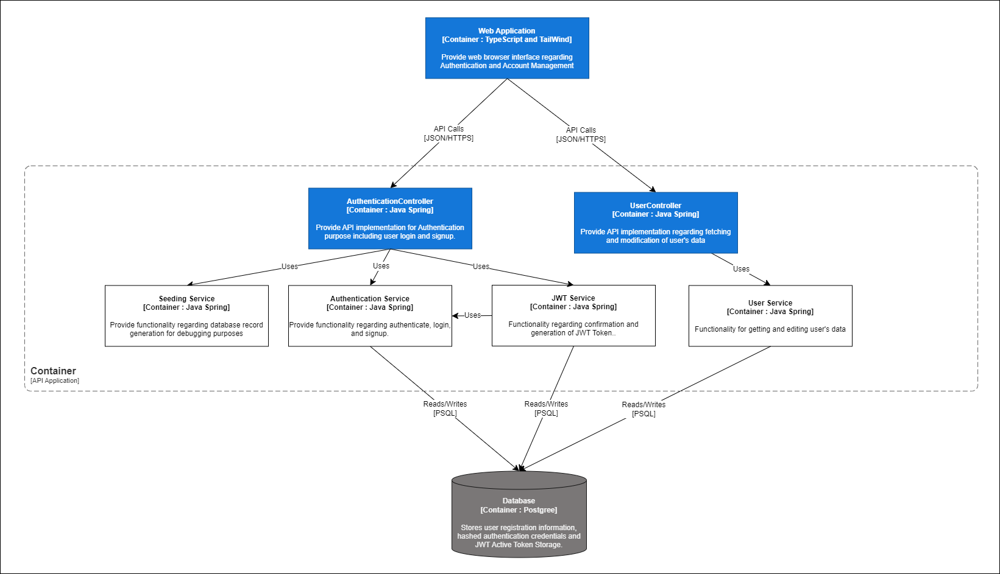
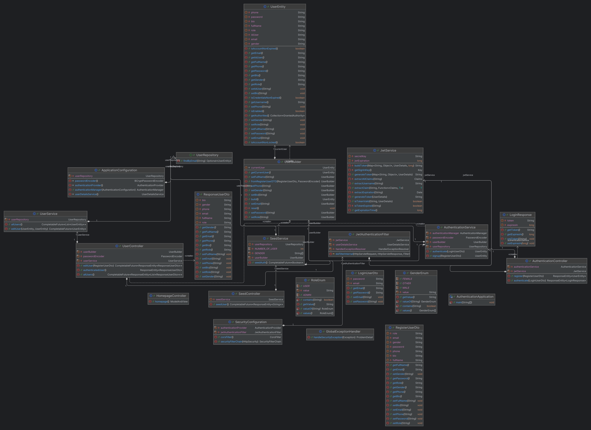
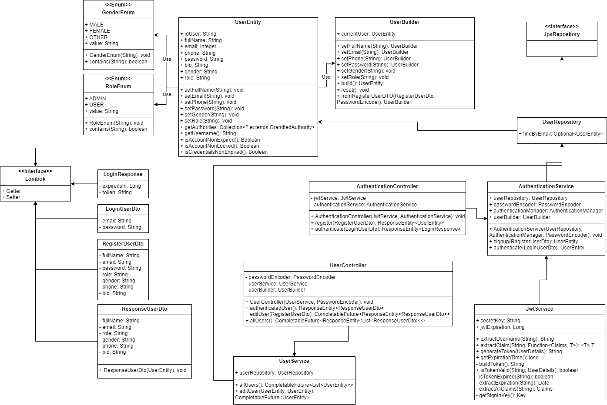
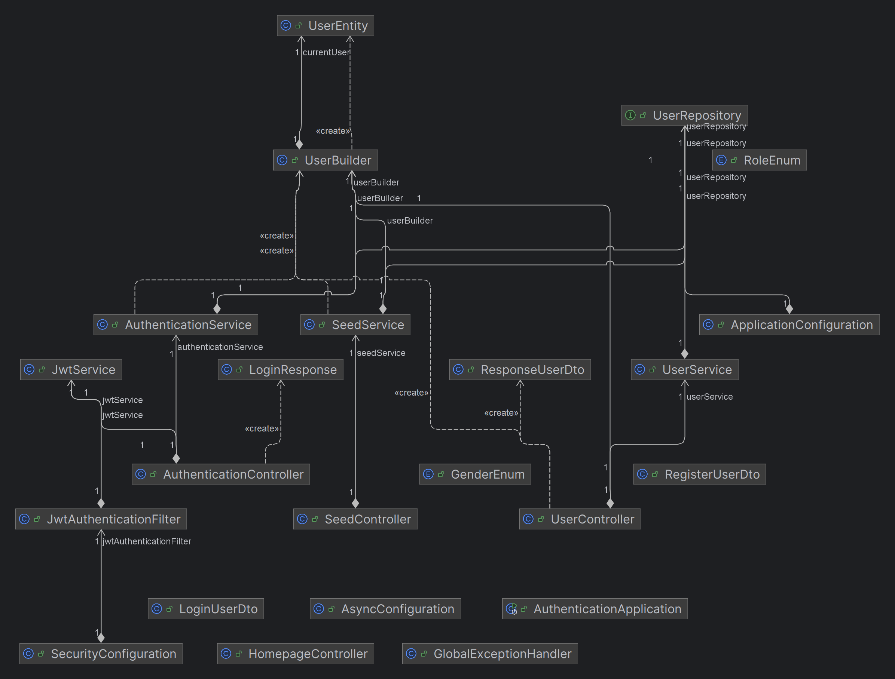

> Proyek ini dibuat untuk memenuhi tugas Proyek Akhir Semester (PAS)
> pada mata kuliah Pemrograman Lanjut (CSCM602223) yang
> diselenggarakan oleh Fakultas Ilmu Komputer, Universitas Indonesia
> pada Semester Genap, Tahun Ajaran 2023/2024.

--------------------------------------------------------------------------------------------
# Buku.ID-authentication

Buku.ID-authentication is the component of the Buku.ID e-commerce platform, focused on managing user authentication and profile information. This service ensures secure access control and handles user credentials and session management efficiently.

## Kelompok A-7

-  [Eryawan Presma Yulianrifat](https://github.com/eryawww) `(2206041335)` 
-  [Restu Ahmad Ar Ridho](https://github.com/restuaar) `(2206028951)` 
-  [Samuel Taniel Mulyadi](https://github.com/SamuelTanielM) `(2206081805)` 
-  [Tegar Wahyu Khisbulloh](https://github.com/tegar-wahyu) `(2206082032)` 
-  [Vinka Alrezky As](https://github.com/vinkakniv) `(2206820200)` 

Responsible for this service are [Eryawan Presma Yulianrifat](https://github.com/eryawww) and [Restu Ahmad Ar Ridho](https://github.com/restuaar)

## Features

- **User Registration**: Allows new users to register on the Buku.ID platform.
- **User Login**: Handles user authentication processes and sessions.
- **Password Management**: Includes features for password resetting and updating.
- **User Profile Management**: Enables users to view and edit their profile details.

## Technology Stack

## Deployment 🚀

Access the service here: [Buku.ID-authentication Deployment](http://34.105.33.26)

## Component Diagram

## Code Diagram
### Code Diagram

### Code Diagram Dependency

--------------------------------------------------------------------------------------------
*© Kelompok A7, Fakultas Ilmu Komputer, Universitas Indonesia - 2023/2024*
